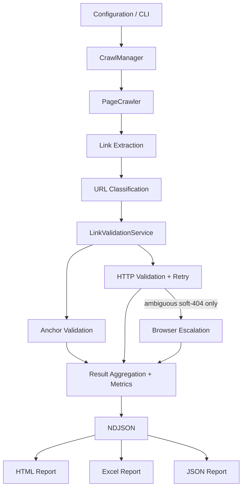

# Web Validation Engine

> A configurable Playwright-based web validation engine for crawling web applications and detecting broken links, redirects, invalid anchors, and soft-404 responses.

Point it at any `http(s)://` target — a public site, or a dev/QA/UAT/staging/production environment you have access to — and it crawls, validates every link it finds, and produces HTML, Excel, and JSON reports with an honest, explicit result for every single link: not just "found," but *checked, and here's what happened*.

## Why This Exists

Web applications accumulate broken links, dead redirects, and stale anchors as they grow — pages get moved, sections get renamed, third-party links rot. HTTP-status checking alone misses a common failure mode: a page that returns `200 OK` but renders a client-side "not found" state (a soft-404), which is especially common on JavaScript-rendered sites. Checking every link with a full browser is accurate but far too slow to do for every link on a large site. This project's core design decision is a hybrid: fast HTTP validation for the common case, with browser-based re-checking reserved for the one case that genuinely needs it.

## What It Does

```text
✓ Crawls accessible web applications (Playwright, headless Chromium)
✓ Discovers and validates every link on every crawled page
✓ Detects broken HTTP responses (4xx/5xx) with real status codes
✓ Detects redirects — by comparing final vs. requested URL, not just status code
✓ Detects and safely terminates redirect loops
✓ Retries transient failures (timeouts, connection resets, 429/5xx) with backoff
✓ Validates in-page anchors (#section links resolve to a real element)
✓ Detects soft-404 responses (HTTP 200, content that looks broken)
✓ Escalates to a real browser check only for ambiguous soft-404 candidates
✓ Parses sitemaps, including sitemap indexes, with cycle protection
✓ Classifies every link (internal / external / anchor / ignored / unsupported)
   so mailto:, tel:, javascript:, data:, file:, and blob: links are never
   mis-treated as HTTP targets
✓ Generates HTML, Excel, and JSON reports — all three agree
✓ Isolates output per run (output/runs/<timestamp>/, never silently merged)
✓ Redacts embedded credentials from URLs before they reach any report
```

**Not implemented** (see [Known Limitations](#known-limitations)): authentication/login flows, screenshot capture.

## Architecture



One `CrawlManager` per run owns a `BrowserManager` (a single shared Playwright browser), a `StateManager` (visited-URL tracking, shared across runs for resume), and one shared `LinkValidationService` for the whole run. Every discovered link is classified before anything else happens to it — that's what keeps `javascript:`/`data:`/`file:`/`blob:` links from ever reaching axios or `page.goto()`, and what keeps a `#section` anchor from being HTTP-fetched at all.

## Validation Strategy

**HTTP validation** handles the overwhelming majority of links: a GET (internal) or HEAD (external) request, with retry on transient failures (timeouts, connection resets, `429`, `5xx`) and real redirect detection.

**Anchor validation** runs once per crawled page (not once per link) and checks whether each `#section` link's target actually exists in the DOM.

**Browser escalation is deliberately narrow.** Not every link opens in a browser — that would be far too slow at scale. It only triggers when an internal link's HTTP check comes back `200` *and* the response body already looks like a soft-404 by keyword match. That's the one case plain HTTP genuinely can't resolve on its own: "the server says OK, but is this actually a client-rendered error page?" A definitive `404`/`500` is never re-checked in a browser — it's already known.

## Quick Start

```bash
git clone https://github.com/SurathDurgaprasad/web-validation-engine.git
cd web-validation-engine
npm install
npx playwright install chromium
npm test
```

Run a crawl:

```bash
npm run crawl                                          # uses config/config.json (example.com, tiny/safe defaults)
npm run crawl -- --url https://example.com --max-pages 5 --max-depth 1
node crawler.js --config config/examples/internal-staging.config.json
```

## Configuration

`target.baseUrl` is the only required field — everything else has a documented default.

```json
{
  "target": {
    "baseUrl": "https://example.com",
    "environment": "staging"
  },
  "crawl": {
    "maxPages": 100,
    "maxDepth": 3
  },
  "validation": {
    "browserFallback": true,
    "retry": true
  }
}
```

See `config/config.json` for the full schema (`target` / `crawl` / `validation` / `scope` / `reporting`) and `config/examples/` for a non-public/internal-target example. Malformed configuration (bad URL, wrong type, out-of-range number) fails immediately with a specific error naming the field — nothing is silently normalized.

## CLI Options

| Option | Description |
|---|---|
| `--config <path>` | Configuration file path (default: `./config/config.json`) |
| `--url <url>` | Override `target.baseUrl` |
| `--environment <name>` | Label the target environment (metadata only) |
| `--max-pages <n>` | Override `crawl.maxPages` |
| `--max-depth <n>` | Override `crawl.maxDepth` |
| `--output <dir>` | Override the output directory |

CLI overrides go through the same validation as the config file — an invalid `--url` fails with the same clear, field-identified error.

## Validation States

Every link ends up in exactly one state, consistently across NDJSON, JSON, HTML, and Excel output. An unchecked link is never reported as valid.

| State | Meaning |
|---|---|
| `valid` | Checked and working |
| `broken` | Checked and failed (bad status code, missing anchor target, or browser-confirmed broken) |
| `redirect` | Checked and resolves via a redirect |
| `soft404` | HTTP layer flagged a possible soft-404 and browser escalation didn't (or couldn't) confirm it either way |
| `not_checked` | Deliberately never validated — `mailto:`/`tel:`/`sms:` links, `javascript:`/`data:`/`file:`/`blob:` links, or validation turned off in config |
| `error` | Validation was attempted but couldn't complete |

## Reports

Each run gets its own isolated directory:

```text
output/
└── runs/
    └── <timestamp>/
        ├── results.ndjson      # raw per-link records, streamed incrementally
        ├── report.html         # interactive dashboard
        ├── report.xlsx         # multi-sheet Excel workbook
        ├── report.json         # full structured export
        └── run-manifest.json   # target + config summary for this run
```

## Testing

```bash
npm test
```

104 tests via Node's built-in `node:test` runner — no test framework dependency. Covers:

- **Unit tests** — HTTP validation, URL classification, anchor validation, soft-404 detection, config validation
- **Regression tests** — a redirect-chain safety fix (cyclic/self-referencing structures, using controlled mocks) and an anchor-fragment deduplication fix (distinct `#section` links must stay distinct)
- **Local fixture integration tests** — a real HTTP server (`node:http`, no external network) exercising retry behavior, sitemap-index parsing, and report-output consistency
- **End-to-end test** — a real Playwright browser crawling a local fixture page through the entire pipeline (extraction → classification → validation → persistence → reports), asserting on the actual output records

## Project Structure

```text
config/        Configuration loading, validation, and example targets
crawler/       Crawl orchestration, page processing, link-validation service
validators/    HTTP, browser, and anchor validation
extractors/    Link extraction and sitemap parsing
reporters/     HTML, Excel, and JSON report generation
utils/         URL classification/normalization, retry, metrics, logging
test/          Automated test suite (unit, regression, integration, E2E)
docs/          Engineering history — how this was built (see docs/README.md)
```

## Known Limitations

- **No authentication support.** Pages behind a login wall are reported as broken/unreachable past the login boundary.
- **Screenshot capture is not implemented**, despite a field reserved for it in the data model.
- **Not a general SPA crawler.** The soft-404 browser escalation catches one specific ambiguous case (200 + content that looks broken) — links that only appear after client-side interaction aren't discovered.
- **Large crawls produce large output.** Per-run isolation and de-duplication of page-level data keep this bounded, but a multi-thousand-page crawl will still generate a sizeable NDJSON/JSON/HTML file.
- **`robots.txt` handling for internal/enterprise targets** hasn't been verified against a real corporate proxy/auth setup — only against the documented graceful-degrade behavior.

## Roadmap

Realistic future directions — not current features:

- Authenticated/logged-in application support
- Screenshot evidence attached to broken-link findings
- More scalable result storage for very large crawls
- Example CI/CD integration (scheduled validation runs)

## Engineering History

This project has a documented development history — an initial repository audit, a generalization/integration pass, and a hardening pass that found and fixed real bugs by actually running the pipeline rather than trusting that it worked. See [`docs/`](docs/) for the full record.

## License

[MIT](LICENSE)
